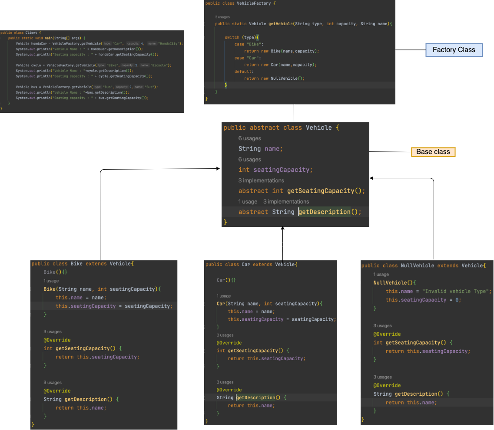

# Factory Design Pattern
#### It is creational design pattern that abstracts the process of object creation.

- It encapsulates the object creation logic within a separate class, known as the factory, which provides a centralized point for object instantiation

